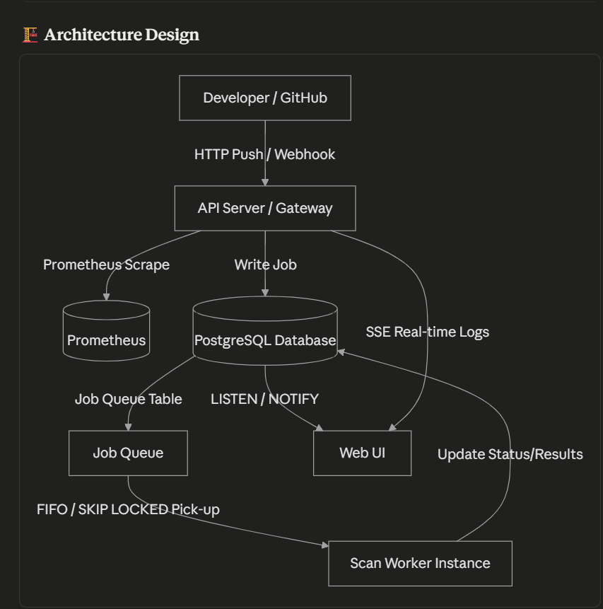

# ShieldOps: Industrial-Grade DevSecOps & Security Automation Platform

[](https://github.com/Ayush-yash/Devops-security/actions)
[](https://opensource.org/licenses/MIT)
[](https://expressjs.com/)
[](https://www.postgresql.org/)
[](https://www.docker.com/)
[](https://prometheus.io/)

ShieldOps is an advanced, production-hardened **DevSecOps Platform** designed to orchestrate, analyze, and gate security pipeline scans. It features a completely decoupled, asynchronous worker-based queue architecture, robust API security controls, real-time log streaming using Server-Sent Events (SSE), Open Policy Agent (OPA) gate validation, and full Prometheus/Grafana observability.

## 📑 Table of Contents
- [Key Features & Industrial Standards](#-key-features--industrial-standards)
- [Tech Stack](#%EF%B8%8F-tech-stack)
- [Architecture Design](#%EF%B8%8F-architecture-design)
- [Screenshots](#-screenshots)
- [Getting Started](#-getting-started)
- [Testing](#-testing)
- [License](#-license)

---

## 🚀 Key Features & Industrial Standards

### 1. High-Performance Asynchronous Scan Orchestration
- **Decoupled Architecture**: Scans run in a separate worker process (`worker.js`) to keep the API server highly responsive.
- **`SKIP LOCKED` Queue Mechanics**: Uses PostgreSQL-based queue tables with row locking (`FOR UPDATE SKIP LOCKED`) allowing concurrent worker instances to fetch jobs without race conditions or lock contention.
- **Self-Healing & Retries**: Automatic execution retries for failed scan jobs using **Exponential Backoff**: `POWER(2, retry_count) * 5 seconds`.

### 2. Enterprise-Grade Security Hardening (OWASP Top 10)
- **HTTP Hardening**: Helmet integration with custom Content Security Policy (CSP), Frame Options, and HSTS headers.
- **API Protection**: Sliding-window rate limiters on public API paths and strict whitelisted CORS controls.
- **HMAC Signatures**: Validates incoming GitHub Webhook payloads using `sha256` HMAC signatures with constant-time equality matching to prevent timing attacks.
- **Role-Based Access Control (RBAC)**: Fine-grained user role checks (`ADMIN`, `SECURITY_LEAD`, `DEVELOPER`) validating sensitive operations.
- **SQLi Protection**: Parameterized queries across all database transactions.

### 3. Advanced Policy Decisions & Waiver Workflows
- **OPA Decision Engine**: Automated gate blocking on `CRITICAL` or `HIGH` vulnerabilities.
- **Waiver Registry**: Granular waiver management allowing developers to request a temporary bypass for specific vulnerabilities, subject to validation and expiry timers.

### 4. Real-time Events & Observability
- **Server-Sent Events (SSE)**: Leverages PostgreSQL `LISTEN / NOTIFY` to stream pipeline execution logs and status transitions to the browser UI in real time.
- **Request Correlation Tracing**: Automatically generates and propagates `X-Correlation-ID` UUID headers across the API, database records, worker processes, and JSON logs.
- **Full Metrics Scrapes**: Exposes Prometheus-compatible `/metrics` metrics, visualized through pre-provisioned Grafana dashboards.

---

## 🛠️ Tech Stack
- **Backend API**: Node.js, Express
- **Scan Engine**: Custom Regex and Database parsers (SAST, SCA, Secrets, Container, IaC)
- **Database**: PostgreSQL (v15)
- **Monitoring**: Prometheus (v2.45.0), Grafana (v10.0.0)
- **Containerization**: Docker, Docker Compose
- **Testing**: Jest, Supertest

---

## 🏗️ Architecture Design



---

## 📸 Screenshots

*(Add visual proof of your working dashboard here! You can save your screenshots in a `screenshots/` directory and link them).*

- **Dashboard Overview**: Metrics view showing overall project vulnerability health, open issues, and policies.
- **Live Logs (SSE)**: Real-time scan execution output stream.
- **Observability (Grafana)**: Dynamic metrics charts for API load, scan durations, and worker queue health.

---

## 💻 Getting Started

### Prerequisites
- [Docker & Docker Compose](https://www.docker.com/)

### Running the Platform
1. **Clone the Repository**:
   ```bash
   git clone https://github.com/Ayush-yash/Devops-security.git
   cd Devops-security
   ```

2. **Configure Environment Variables**:
   Create a `.env` file in the root directory:
   ```env
   PORT=8080
   DATABASE_URL=postgres://shieldops:securepassword@db:5432/shieldops
   GITHUB_WEBHOOK_SECRET=your_super_secret_webhook_key
   ```

3. **Start the Platform with Docker Compose**:
   ```bash
   docker-compose up --build
   ```

4. **Access the Services**:
   - **ShieldOps Dashboard**: `http://localhost:8080`
   - **Prometheus Dashboard**: `http://localhost:9090`
   - **Grafana Observability**: `http://localhost:3050` (Default Credentials: `admin` / `admin`)

### Production Deployment (Render)
To deploy this platform live in production on Render:

1. **Deploy PostgreSQL Database**:
   - Create a new **PostgreSQL** instance on Render.
   - Note the **Internal Database URL** for other services.

2. **Deploy Web Service (API + UI)**:
   - Create a new **Web Service** pointing to your GitHub repository.
   - Set **Build Command**: `npm install`
   - Set **Start Command**: `npm start`
   - Add environment variables:
     - `PORT`: `8080` (or leave default)
     - `DATABASE_URL`: *[Your Render Internal Database URL]*
     - `GITHUB_WEBHOOK_SECRET`: *[Your secret key]*
     - `CORS_ALLOWED_ORIGINS`: `https://your-custom-domain.com` (if applicable)

3. **Deploy Background Worker**:
   - Create a new **Background Worker** pointing to your GitHub repository.
   - Set **Runtime**: `Docker`
   - Set **Dockerfile Path**: `Dockerfile.worker`
   - Add environment variable:
     - `DATABASE_URL`: *[Your Render Internal Database URL]*

---

## 🧪 Testing

The codebase includes comprehensive Unit, Integration, API, and End-to-End (E2E) tests.

Run the test suite:
```bash
npm run test
```

Generate test coverage report:
```bash
npm run test:coverage
```

---

## 📄 License
This project is licensed under the MIT License - see the [LICENSE](LICENSE) file for details.
