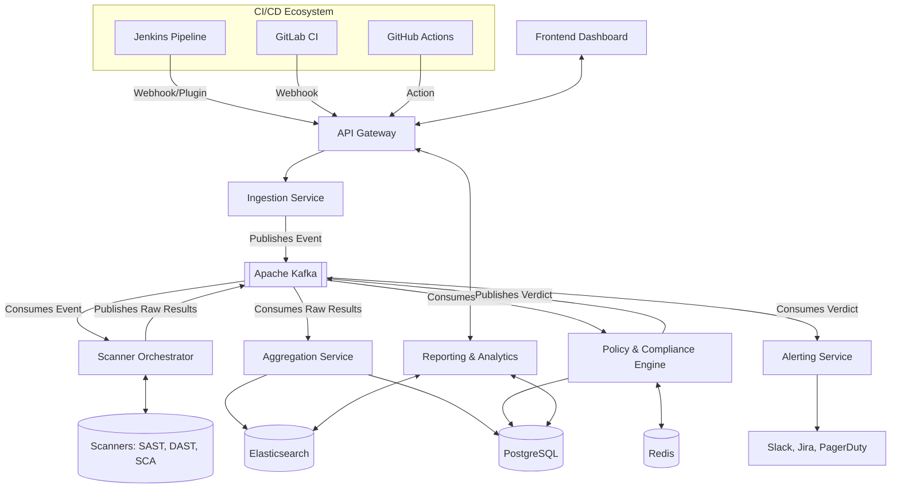

# DevSecOps Pipeline Security Platform - Architecture Design

## 1. Overview & Problem Statement

### The Problem
Traditional security checks are manually performed late in the software development lifecycle (SDLC). This approach is:
*   **Slow & Bottlenecked:** Security audits delay release schedules, creating tension between development and security teams.
*   **Error-Prone:** Manual checks miss critical vulnerabilities, leading to insecure code being deployed to production.
*   **Expensive to Fix:** Resolving a vulnerability in production requires significantly more resources and hotfixes than catching it early in development.

### The Solution: Automated "Shift Left" Security
This platform automates security gates inside the active CI/CD pipelines (Jenkins, GitLab CI, GitHub Actions). By running automated, parallel scans (SAST, SCA, Secrets, Container) on every code push or merge request:
1.  **Vulnerabilities are caught early** ("shifting left" in the SDLC).
2.  **Policies are automatically enforced** via Open Policy Agent (OPA) to block builds with critical findings.
3.  **Vulnerabilities are centralized** on a single unified dashboard, enabling fast automated or assisted remediation.

This document outlines the high-level architecture designed to support 500+ concurrent pipelines implementing this automated validation.

## 2. Microservices Breakdown

The platform is designed using a microservices architecture to ensure independent scalability, fault tolerance, and separation of concerns.

*   **API Gateway:** The single entry point for all external traffic (UI, CI/CD tools, third-party integrations). Handles authentication, authorization, rate limiting, and request routing.
*   **Ingestion Service:** A high-throughput service responsible for receiving webhooks and events from CI/CD systems (Jenkins, GitLab, GitHub). It validates payloads and pushes them to the message broker.
*   **Scanner Orchestration Service:** Consumes events from the broker and manages the execution of security scanners. It can trigger internal scanner workers or integrate with external commercial/open-source scanning tools.
*   **Policy & Compliance Engine:** Evaluates the aggregated scan results against predefined organizational policies (e.g., Open Policy Agent (OPA) rules). Determines whether a pipeline should pass, fail, or require manual approval based on severity thresholds.
*   **Aggregation & Correlation Service:** Consumes raw scan results, normalizes the data, deduplicates findings, and stores them in the databases for long-term retention and querying.
*   **Alerting & Notification Service:** Monitors the event stream for critical findings or policy violations and dispatches alerts to external systems like Slack, Microsoft Teams, Jira, or PagerDuty.
*   **Reporting & Analytics Service:** Serves the frontend dashboard. Aggregates data for vulnerability trends, MTTR (Mean Time To Remediation), and compliance postures.
*   **Frontend (Web UI):** The user interface for security teams and developers to view dashboards, configure policies, manage integrations, and triage vulnerabilities.

## 3. Tech Stack Recommendation

| Component | Technology | Rationale |
| :--- | :--- | :--- |
| **Backend Services** | **Go (Golang) / Node.js / Python (FastAPI)** | Multi-language microservices: Go for high-throughput ingestion/orchestrator core; FastAPI/Node.js for reporting, analytics, and metadata APIs. |
| **Frontend** | **React.js (TypeScript)** | Component-based interactive UI for security dashboards and policy builders. |
| **Databases** | **PostgreSQL & Elasticsearch** | Relational metadata in PostgreSQL (ACID-compliant configurations, tenants, and policies); raw scan reports and high-volume index queries in Elasticsearch. |
| **Message Queue** | **Apache Kafka / RabbitMQ** | Distributed event broker for decoupled processing of scans, pipeline status changes, and alerting. Kafka is preferred for high-throughput partitioning. |
| **Security Scanning Tools** | **Semgrep, Trivy, Gitleaks, OWASP ZAP, OPA** | Specialized scanners: Semgrep (SAST), Trivy (SCA/Container), Gitleaks (Secrets), OWASP ZAP (DAST), and Open Policy Agent (OPA) for Policy Decision Gating. |
| **DevOps & Infrastructure** | **Docker, Kubernetes, Helm** | Containerization of services, deployment orchestration across cloud/hybrid nodes, and standardized deployment templates via Helm charts. |

## 4. CI/CD Tool Integrations

To support seamless integration, the platform adopts an API-first approach, supplemented by dedicated plugins/actions.

*   **GitHub Actions:**
    *   **Integration:** A custom GitHub Action (`uses: my-org/devsecops-action@v1`) added to the `.github/workflows` YAML.
    *   **Mechanism:** The action bundles the source code (or image), securely authenticates with the API Gateway, and posts the context. It then polls for the Policy Engine's verdict to pass/fail the action step.
*   **GitLab CI:**
    *   **Integration:** A custom Docker image used within a `.gitlab-ci.yml` job.
    *   **Mechanism:** Utilizes GitLab Webhooks to notify the Ingestion Service of pipeline starts/stops, and the custom job pushes artifacts to the platform, failing the stage if the Policy Engine returns a non-zero exit code.
*   **Jenkins:**
    *   **Integration:** A custom Jenkins Plugin or a Shared Library step (e.g., `runSecurityScan()`).
    *   **Mechanism:** The plugin injects itself into the Jenkins pipeline lifecycle, sending build context and receiving synchronous/asynchronous feedback on security gates.

## 5. Data Flow Diagram

## 6. Scalability Considerations for 500+ Pipelines

Handling 500+ concurrent pipelines requires a robust, scalable architecture to prevent bottlenecks and ensure CI/CD velocity is not impacted.

1.  **Asynchronous Event-Driven Architecture:**
    *   By using **Kafka**, the Ingestion Service can acknowledge receipt of CI/CD payloads in milliseconds, unblocking the pipeline. The heavy lifting (scanning, analysis) happens asynchronously.
2.  **Stateless Microservices & Horizontal Pod Autoscaling (HPA):**
    *   All core services (Ingestion, Orchestrator, Policy) are stateless. In Kubernetes, HPA is configured based on CPU/Memory and custom metrics (e.g., Kafka consumer lag). During peak commit hours, the cluster automatically spins up more scanner worker pods.
3.  **Database Sharding and Read Replicas:**
    *   **PostgreSQL:** Implement read replicas for heavy read operations (e.g., dashboard analytics) to keep the primary node free for writes from the Aggregation Service.
    *   **Elasticsearch:** Configure index lifecycle management (ILM) and shard data across multiple nodes to ensure fast search queries over millions of scan records.
4.  **Intelligent Scanning (Diff-based/Incremental):**
    *   Instead of running full scans on every commit, the Orchestrator should support incremental scanning. By analyzing Git diffs, it only scans changed files or updated dependencies, significantly reducing compute time and load.
5.  **Caching Aggressive Policies:**
    *   The Policy Engine queries **Redis** for active rulesets rather than hitting PostgreSQL for every evaluation, ensuring sub-millisecond policy decisions.
6.  **Rate Limiting & Backpressure:**
    *   The API Gateway enforces rate limiting per tenant/project to prevent noisy neighbor problems. If the system is overwhelmed, Kafka naturally provides backpressure, buffering events until consumer pods catch up.
