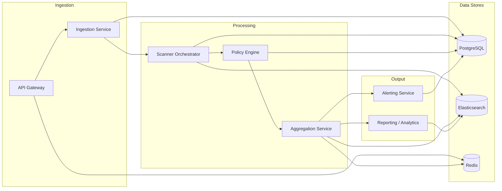
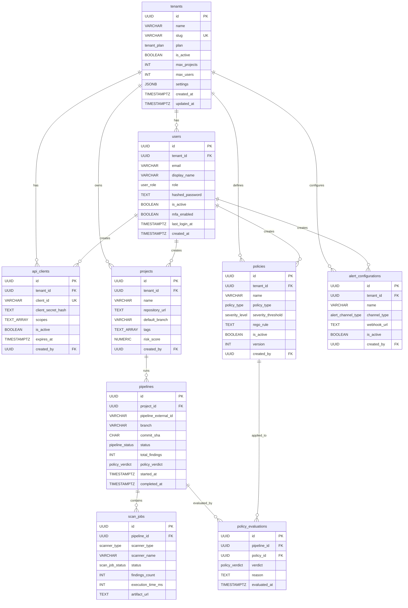

# DevSecOps Pipeline Security Platform — Database Schema Document

> **Version:** 1.0.0  
> **Date:** 2026-08-09  
> **Status:** Production  
> **Authors:** Platform Architecture Team

---

## Table of Contents

1. [Architecture Overview](#architecture-overview)
2. [PostgreSQL Schemas](#postgresql-schemas)
3. [Entity-Relationship Diagram](#entity-relationship-diagram)
4. [Elasticsearch Index Mappings](#elasticsearch-index-mappings)
5. [Redis Caching Strategy](#redis-caching-strategy)
6. [Design Decisions & Rationale](#design-decisions--rationale)

---

## Architecture Overview



| Store | Role |
|---|---|
| **PostgreSQL 16+** | System of record for tenants, users, projects, pipelines, policies, and configuration. ACID-compliant relational data with strong referential integrity. |
| **Elasticsearch 8.x** | High-volume vulnerability findings and audit logs. Optimized for full-text search, faceted filtering, and time-series aggregation. |
| **Redis 7.x (Cluster)** | Hot-path caching, rate limiting, real-time pipeline status, and pre-computed dashboard metrics. |

---

## PostgreSQL Schemas

> [!IMPORTANT]
> All tables use `gen_random_uuid()` (PG 13+) for primary keys. Timestamps are stored as `TIMESTAMPTZ` to ensure correct multi-timezone behavior. Row-Level Security (RLS) policies should be applied on top of this schema for tenant isolation — omitted here for clarity.

### Enum Types

```sql
-- ============================================================
-- ENUM TYPES
-- ============================================================

CREATE TYPE user_role AS ENUM (
    'ADMIN',
    'SECURITY_LEAD',
    'DEVELOPER',
    'VIEWER'
);

CREATE TYPE tenant_plan AS ENUM (
    'FREE',
    'TEAM',
    'BUSINESS',
    'ENTERPRISE'
);

CREATE TYPE pipeline_status AS ENUM (
    'PENDING',
    'SCANNING',
    'PASSED',
    'FAILED',
    'ERROR',
    'CANCELLED'
);

CREATE TYPE scanner_type AS ENUM (
    'SAST',
    'DAST',
    'SCA',
    'SECRETS',
    'CONTAINER_SCAN',
    'IAC_SCAN'
);

CREATE TYPE scan_job_status AS ENUM (
    'QUEUED',
    'RUNNING',
    'COMPLETED',
    'FAILED',
    'TIMED_OUT',
    'CANCELLED'
);

CREATE TYPE policy_type AS ENUM (
    'GATE',          -- Hard gate: blocks pipeline
    'ADVISORY',      -- Soft warning: does not block
    'COMPLIANCE'     -- Regulatory/compliance mapping
);

CREATE TYPE policy_verdict AS ENUM (
    'PASS',
    'FAIL',
    'WARN',
    'ERROR'
);

CREATE TYPE alert_channel_type AS ENUM (
    'SLACK',
    'TEAMS',
    'JIRA',
    'PAGERDUTY',
    'EMAIL',
    'WEBHOOK'
);

CREATE TYPE severity_level AS ENUM (
    'CRITICAL',
    'HIGH',
    'MEDIUM',
    'LOW',
    'INFO'
);
```

> [!NOTE]
> Enums are used over check constraints because PostgreSQL enums are stored as 4-byte integers internally, yielding better index performance and type safety. When adding new values, use `ALTER TYPE ... ADD VALUE` — this is non-destructive and does not require a table rewrite.

---

### 1. `tenants`

Multi-tenant root entity. Every business object in the platform belongs to exactly one tenant.

```sql
-- ============================================================
-- TABLE: tenants
-- Purpose: Root entity for multi-tenant isolation.
-- ============================================================
CREATE TABLE tenants (
    id              UUID PRIMARY KEY DEFAULT gen_random_uuid(),
    name            VARCHAR(256)  NOT NULL,
    slug            VARCHAR(128)  NOT NULL,           -- URL-safe identifier
    plan            tenant_plan   NOT NULL DEFAULT 'FREE',
    is_active       BOOLEAN       NOT NULL DEFAULT TRUE,
    max_projects    INT           NOT NULL DEFAULT 10, -- plan-based limit
    max_users       INT           NOT NULL DEFAULT 5,
    settings        JSONB         NOT NULL DEFAULT '{}',  -- feature flags, overrides
    created_at      TIMESTAMPTZ   NOT NULL DEFAULT now(),
    updated_at      TIMESTAMPTZ   NOT NULL DEFAULT now(),

    CONSTRAINT uq_tenants_slug UNIQUE (slug),
    CONSTRAINT chk_tenants_slug_format CHECK (slug ~ '^[a-z0-9][a-z0-9\-]{1,126}[a-z0-9]$')
);

-- Indexes
CREATE INDEX idx_tenants_plan     ON tenants (plan) WHERE is_active = TRUE;
CREATE INDEX idx_tenants_created  ON tenants (created_at DESC);

-- Trigger: auto-update updated_at
CREATE OR REPLACE FUNCTION trg_set_updated_at()
RETURNS TRIGGER AS $$
BEGIN
    NEW.updated_at = now();
    RETURN NEW;
END;
$$ LANGUAGE plpgsql;

CREATE TRIGGER trg_tenants_updated_at
    BEFORE UPDATE ON tenants
    FOR EACH ROW EXECUTE FUNCTION trg_set_updated_at();
```

---

### 2. `users`

User accounts with role-based access control. Passwords are stored as Argon2id hashes.

```sql
-- ============================================================
-- TABLE: users
-- Purpose: Human user accounts with RBAC.
-- ============================================================
CREATE TABLE users (
    id                UUID PRIMARY KEY DEFAULT gen_random_uuid(),
    tenant_id         UUID          NOT NULL REFERENCES tenants(id) ON DELETE CASCADE,
    email             VARCHAR(320)  NOT NULL,          -- RFC 5321 max length
    display_name      VARCHAR(256)  NOT NULL,
    role              user_role     NOT NULL DEFAULT 'DEVELOPER',
    hashed_password   TEXT          NOT NULL,          -- Argon2id hash
    is_active         BOOLEAN       NOT NULL DEFAULT TRUE,
    mfa_enabled       BOOLEAN       NOT NULL DEFAULT FALSE,
    mfa_secret_enc    BYTEA,                           -- AES-256-GCM encrypted TOTP secret
    last_login_at     TIMESTAMPTZ,
    password_changed_at TIMESTAMPTZ NOT NULL DEFAULT now(),
    failed_login_count  INT         NOT NULL DEFAULT 0,
    locked_until      TIMESTAMPTZ,
    created_at        TIMESTAMPTZ   NOT NULL DEFAULT now(),
    updated_at        TIMESTAMPTZ   NOT NULL DEFAULT now(),

    -- A user's email must be unique within a tenant
    CONSTRAINT uq_users_tenant_email UNIQUE (tenant_id, email),
    CONSTRAINT chk_users_email_format CHECK (email ~* '^[A-Za-z0-9._%+\-]+@[A-Za-z0-9.\-]+\.[A-Za-z]{2,}$')
);

-- Indexes
CREATE INDEX idx_users_tenant_id    ON users (tenant_id);
CREATE INDEX idx_users_email        ON users (email);   -- cross-tenant lookup (e.g., login)
CREATE INDEX idx_users_role         ON users (tenant_id, role) WHERE is_active = TRUE;
CREATE INDEX idx_users_last_login   ON users (last_login_at DESC NULLS LAST);

CREATE TRIGGER trg_users_updated_at
    BEFORE UPDATE ON users
    FOR EACH ROW EXECUTE FUNCTION trg_set_updated_at();
```

> [!WARNING]
> Never log or return `hashed_password` or `mfa_secret_enc` in API responses. The application layer **must** exclude these columns from all SELECT projections used by read endpoints.

---

### 3. `api_clients`

Machine-to-machine service accounts used by CI/CD runners, scanners, and external integrations.

```sql
-- ============================================================
-- TABLE: api_clients
-- Purpose: Service accounts for CI/CD runners & integrations.
-- ============================================================
CREATE TABLE api_clients (
    id                  UUID PRIMARY KEY DEFAULT gen_random_uuid(),
    tenant_id           UUID          NOT NULL REFERENCES tenants(id) ON DELETE CASCADE,
    name                VARCHAR(256)  NOT NULL,
    client_id           VARCHAR(64)   NOT NULL,         -- public identifier (e.g., "ci-runner-prod")
    client_secret_hash  TEXT          NOT NULL,          -- bcrypt / Argon2id hash of the secret
    scopes              TEXT[]        NOT NULL DEFAULT '{}', -- e.g., '{scan:write, findings:read}'
    is_active           BOOLEAN       NOT NULL DEFAULT TRUE,
    last_used_at        TIMESTAMPTZ,
    expires_at          TIMESTAMPTZ,                     -- NULL = no expiry
    created_by          UUID          REFERENCES users(id) ON DELETE SET NULL,
    created_at          TIMESTAMPTZ   NOT NULL DEFAULT now(),
    updated_at          TIMESTAMPTZ   NOT NULL DEFAULT now(),

    CONSTRAINT uq_api_clients_client_id UNIQUE (client_id),
    CONSTRAINT chk_api_clients_scopes_not_empty CHECK (array_length(scopes, 1) > 0)
);

-- Indexes
CREATE INDEX idx_api_clients_tenant   ON api_clients (tenant_id) WHERE is_active = TRUE;
CREATE INDEX idx_api_clients_expires  ON api_clients (expires_at) WHERE expires_at IS NOT NULL;
CREATE INDEX idx_api_clients_scopes   ON api_clients USING GIN (scopes);

CREATE TRIGGER trg_api_clients_updated_at
    BEFORE UPDATE ON api_clients
    FOR EACH ROW EXECUTE FUNCTION trg_set_updated_at();
```

> [!TIP]
> The `scopes` array uses PostgreSQL's native `TEXT[]` with a GIN index. This enables queries like `WHERE scopes @> ARRAY['scan:write']` to efficiently check if a client has a specific scope.

---

### 4. `projects`

Repositories or codebases registered for scanning within a tenant.

```sql
-- ============================================================
-- TABLE: projects
-- Purpose: Repositories / codebases registered for scanning.
-- ============================================================
CREATE TABLE projects (
    id              UUID PRIMARY KEY DEFAULT gen_random_uuid(),
    tenant_id       UUID          NOT NULL REFERENCES tenants(id) ON DELETE CASCADE,
    name            VARCHAR(256)  NOT NULL,
    description     TEXT,
    repository_url  TEXT          NOT NULL,             -- e.g., https://github.com/org/repo
    default_branch  VARCHAR(256)  NOT NULL DEFAULT 'main',
    language        VARCHAR(64),                        -- primary language (auto-detected)
    tags            TEXT[]        NOT NULL DEFAULT '{}',
    is_archived     BOOLEAN       NOT NULL DEFAULT FALSE,
    last_scan_at    TIMESTAMPTZ,
    risk_score      NUMERIC(5,2),                       -- aggregated 0.00-100.00
    created_by      UUID          REFERENCES users(id) ON DELETE SET NULL,
    created_at      TIMESTAMPTZ   NOT NULL DEFAULT now(),
    updated_at      TIMESTAMPTZ   NOT NULL DEFAULT now(),

    -- Prevent duplicate repos within a tenant
    CONSTRAINT uq_projects_tenant_repo UNIQUE (tenant_id, repository_url),
    CONSTRAINT chk_projects_risk_score CHECK (risk_score IS NULL OR (risk_score >= 0 AND risk_score <= 100))
);

-- Indexes
CREATE INDEX idx_projects_tenant      ON projects (tenant_id) WHERE is_archived = FALSE;
CREATE INDEX idx_projects_last_scan   ON projects (last_scan_at DESC NULLS LAST);
CREATE INDEX idx_projects_tags        ON projects USING GIN (tags);
CREATE INDEX idx_projects_risk        ON projects (tenant_id, risk_score DESC NULLS LAST)
    WHERE is_archived = FALSE;

CREATE TRIGGER trg_projects_updated_at
    BEFORE UPDATE ON projects
    FOR EACH ROW EXECUTE FUNCTION trg_set_updated_at();
```

---

### 5. `pipelines`

Records of CI/CD pipeline runs that trigger security scanning.

```sql
-- ============================================================
-- TABLE: pipelines
-- Purpose: Pipeline run records linked to projects.
-- ============================================================
CREATE TABLE pipelines (
    id                    UUID PRIMARY KEY DEFAULT gen_random_uuid(),
    project_id            UUID            NOT NULL REFERENCES projects(id) ON DELETE CASCADE,
    pipeline_external_id  VARCHAR(512)    NOT NULL,   -- ID from CI system (e.g., GitHub Actions run ID)
    branch                VARCHAR(256)    NOT NULL,
    commit_sha            CHAR(40)        NOT NULL,   -- full SHA-1
    commit_message        TEXT,
    trigger_actor         VARCHAR(256),                -- username or bot that triggered the run
    trigger_source        VARCHAR(64),                 -- 'push', 'pull_request', 'schedule', 'api'
    status                pipeline_status NOT NULL DEFAULT 'PENDING',
    total_findings        INT             NOT NULL DEFAULT 0,
    critical_findings     INT             NOT NULL DEFAULT 0,
    high_findings         INT             NOT NULL DEFAULT 0,
    policy_verdict        policy_verdict,              -- aggregated gate result
    started_at            TIMESTAMPTZ     NOT NULL DEFAULT now(),
    completed_at          TIMESTAMPTZ,
    duration_ms           INT GENERATED ALWAYS AS (
                            CASE WHEN completed_at IS NOT NULL
                                 THEN EXTRACT(EPOCH FROM (completed_at - started_at))::INT * 1000
                                 ELSE NULL
                            END
                          ) STORED,
    metadata              JSONB           NOT NULL DEFAULT '{}', -- CI-specific metadata
    created_at            TIMESTAMPTZ     NOT NULL DEFAULT now(),

    CONSTRAINT uq_pipelines_project_ext UNIQUE (project_id, pipeline_external_id),
    CONSTRAINT chk_pipelines_sha_format CHECK (commit_sha ~ '^[a-f0-9]{40}$'),
    CONSTRAINT chk_pipelines_completed  CHECK (
        (status IN ('PASSED','FAILED','ERROR','CANCELLED') AND completed_at IS NOT NULL)
        OR (status IN ('PENDING','SCANNING') AND completed_at IS NULL)
    )
);

-- Indexes
CREATE INDEX idx_pipelines_project_status ON pipelines (project_id, status);
CREATE INDEX idx_pipelines_started        ON pipelines (started_at DESC);
CREATE INDEX idx_pipelines_branch         ON pipelines (project_id, branch, started_at DESC);
CREATE INDEX idx_pipelines_commit         ON pipelines (commit_sha);
CREATE INDEX idx_pipelines_status_active  ON pipelines (status)
    WHERE status IN ('PENDING', 'SCANNING');

-- Partial index for quick "latest pipeline per project" queries
CREATE INDEX idx_pipelines_project_latest ON pipelines (project_id, created_at DESC);
```

> [!NOTE]
> `duration_ms` is a generated stored column — it is computed automatically by PostgreSQL and updated on write. This avoids inconsistencies between `started_at`, `completed_at`, and a manually-maintained duration field.

---

### 6. `scan_jobs`

Individual scanner executions within a pipeline. A single pipeline may fan out to multiple scan jobs (SAST, SCA, Secrets, etc.) in parallel.

```sql
-- ============================================================
-- TABLE: scan_jobs
-- Purpose: Individual scan executions within a pipeline.
-- ============================================================
CREATE TABLE scan_jobs (
    id                UUID PRIMARY KEY DEFAULT gen_random_uuid(),
    pipeline_id       UUID            NOT NULL REFERENCES pipelines(id) ON DELETE CASCADE,
    scanner_type      scanner_type    NOT NULL,
    scanner_name      VARCHAR(128)    NOT NULL,        -- e.g., 'Semgrep', 'Trivy', 'Gitleaks'
    scanner_version   VARCHAR(64),
    status            scan_job_status NOT NULL DEFAULT 'QUEUED',
    findings_count    INT             NOT NULL DEFAULT 0,
    critical_count    INT             NOT NULL DEFAULT 0,
    high_count        INT             NOT NULL DEFAULT 0,
    medium_count      INT             NOT NULL DEFAULT 0,
    low_count         INT             NOT NULL DEFAULT 0,
    info_count        INT             NOT NULL DEFAULT 0,
    execution_time_ms INT,
    error_message     TEXT,
    worker_id         VARCHAR(256),                     -- ID of the worker node that ran this job
    artifact_url      TEXT,                             -- S3/GCS URL to raw scanner output
    started_at        TIMESTAMPTZ,
    completed_at      TIMESTAMPTZ,
    created_at        TIMESTAMPTZ     NOT NULL DEFAULT now(),

    -- Prevent running the same scanner type twice in one pipeline
    CONSTRAINT uq_scan_jobs_pipeline_scanner UNIQUE (pipeline_id, scanner_type, scanner_name),
    CONSTRAINT chk_scan_jobs_execution_time CHECK (execution_time_ms IS NULL OR execution_time_ms >= 0),
    CONSTRAINT chk_scan_jobs_findings CHECK (
        findings_count = critical_count + high_count + medium_count + low_count + info_count
    )
);

-- Indexes
CREATE INDEX idx_scan_jobs_pipeline     ON scan_jobs (pipeline_id);
CREATE INDEX idx_scan_jobs_status       ON scan_jobs (status) WHERE status IN ('QUEUED', 'RUNNING');
CREATE INDEX idx_scan_jobs_type         ON scan_jobs (scanner_type, created_at DESC);
CREATE INDEX idx_scan_jobs_scanner_name ON scan_jobs (scanner_name);
```

---

### 7. `policies`

Security policies and OPA/Rego rules evaluated against pipeline results to produce pass/fail gate decisions.

```sql
-- ============================================================
-- TABLE: policies
-- Purpose: Security policies / OPA Rego rules for pipeline gating.
-- ============================================================
CREATE TABLE policies (
    id                  UUID PRIMARY KEY DEFAULT gen_random_uuid(),
    tenant_id           UUID            NOT NULL REFERENCES tenants(id) ON DELETE CASCADE,
    name                VARCHAR(256)    NOT NULL,
    description         TEXT,
    policy_type         policy_type     NOT NULL DEFAULT 'GATE',
    severity_threshold  severity_level  NOT NULL DEFAULT 'HIGH',
    rego_rule           TEXT            NOT NULL,       -- OPA Rego policy source
    rego_version        VARCHAR(16)     NOT NULL DEFAULT 'v1',
    applies_to_scanners scanner_type[]  NOT NULL DEFAULT '{}', -- empty = all scanners
    applies_to_branches TEXT[]          NOT NULL DEFAULT '{main,master,release/*}',
    is_active           BOOLEAN         NOT NULL DEFAULT TRUE,
    version             INT             NOT NULL DEFAULT 1,
    created_by          UUID            REFERENCES users(id) ON DELETE SET NULL,
    created_at          TIMESTAMPTZ     NOT NULL DEFAULT now(),
    updated_at          TIMESTAMPTZ     NOT NULL DEFAULT now(),

    CONSTRAINT uq_policies_tenant_name UNIQUE (tenant_id, name),
    CONSTRAINT chk_policies_rego_not_empty CHECK (length(trim(rego_rule)) > 0)
);

-- Indexes
CREATE INDEX idx_policies_tenant_active ON policies (tenant_id) WHERE is_active = TRUE;
CREATE INDEX idx_policies_type          ON policies (policy_type) WHERE is_active = TRUE;
CREATE INDEX idx_policies_scanners      ON policies USING GIN (applies_to_scanners)
    WHERE is_active = TRUE;

CREATE TRIGGER trg_policies_updated_at
    BEFORE UPDATE ON policies
    FOR EACH ROW EXECUTE FUNCTION trg_set_updated_at();
```

---

### 8. `policy_evaluations`

Immutable log of every policy evaluation against a pipeline. This is the audit-critical table for compliance reporting.

```sql
-- ============================================================
-- TABLE: policy_evaluations
-- Purpose: Immutable record of policy gate evaluations.
-- ============================================================
CREATE TABLE policy_evaluations (
    id              UUID PRIMARY KEY DEFAULT gen_random_uuid(),
    pipeline_id     UUID            NOT NULL REFERENCES pipelines(id) ON DELETE CASCADE,
    policy_id       UUID            NOT NULL REFERENCES policies(id) ON DELETE RESTRICT,
    policy_version  INT             NOT NULL,          -- snapshot of policy.version at eval time
    verdict         policy_verdict  NOT NULL,
    reason          TEXT,                               -- human-readable explanation
    details         JSONB           NOT NULL DEFAULT '{}', -- structured eval context
    evaluated_at    TIMESTAMPTZ     NOT NULL DEFAULT now(),

    -- Each policy should be evaluated at most once per pipeline
    CONSTRAINT uq_policy_evals_pipeline_policy UNIQUE (pipeline_id, policy_id)
);

-- Indexes
CREATE INDEX idx_policy_evals_pipeline ON policy_evaluations (pipeline_id);
CREATE INDEX idx_policy_evals_policy   ON policy_evaluations (policy_id);
CREATE INDEX idx_policy_evals_verdict  ON policy_evaluations (verdict, evaluated_at DESC);
CREATE INDEX idx_policy_evals_time     ON policy_evaluations (evaluated_at DESC);
```

> [!IMPORTANT]
> `policy_id` uses `ON DELETE RESTRICT` — policies with historical evaluations cannot be deleted, only deactivated via `is_active = FALSE`. This preserves the compliance audit trail.

---

### 9. `alert_configurations`

Notification channel configurations for alerting on policy failures, critical findings, etc.

```sql
-- ============================================================
-- TABLE: alert_configurations
-- Purpose: Notification channel configs per tenant.
-- ============================================================
CREATE TABLE alert_configurations (
    id              UUID PRIMARY KEY DEFAULT gen_random_uuid(),
    tenant_id       UUID              NOT NULL REFERENCES tenants(id) ON DELETE CASCADE,
    name            VARCHAR(256)      NOT NULL,
    channel_type    alert_channel_type NOT NULL,
    webhook_url     TEXT,                               -- Slack/Teams/generic webhook
    config          JSONB             NOT NULL DEFAULT '{}', -- channel-specific config
    severity_filter severity_level[]  NOT NULL DEFAULT '{CRITICAL,HIGH}',
    scanner_filter  scanner_type[]    NOT NULL DEFAULT '{}', -- empty = all
    notify_on       TEXT[]            NOT NULL DEFAULT '{POLICY_FAIL,CRITICAL_FINDING}',
    is_active       BOOLEAN           NOT NULL DEFAULT TRUE,
    last_triggered  TIMESTAMPTZ,
    created_by      UUID              REFERENCES users(id) ON DELETE SET NULL,
    created_at      TIMESTAMPTZ       NOT NULL DEFAULT now(),
    updated_at      TIMESTAMPTZ       NOT NULL DEFAULT now(),

    CONSTRAINT uq_alert_config_tenant_name UNIQUE (tenant_id, name),
    CONSTRAINT chk_alert_config_webhook CHECK (
        (channel_type IN ('SLACK','TEAMS','WEBHOOK','PAGERDUTY') AND webhook_url IS NOT NULL)
        OR (channel_type IN ('JIRA','EMAIL'))
    )
);

-- Indexes
CREATE INDEX idx_alert_config_tenant ON alert_configurations (tenant_id) WHERE is_active = TRUE;
CREATE INDEX idx_alert_config_type   ON alert_configurations (channel_type) WHERE is_active = TRUE;
CREATE INDEX idx_alert_config_severity ON alert_configurations USING GIN (severity_filter)
    WHERE is_active = TRUE;

CREATE TRIGGER trg_alert_config_updated_at
    BEFORE UPDATE ON alert_configurations
    FOR EACH ROW EXECUTE FUNCTION trg_set_updated_at();
```

> [!CAUTION]
> `webhook_url` and the `config` JSONB field may contain secrets (API tokens, auth headers). Encrypt these columns at the application layer (e.g., envelope encryption with a KMS-managed DEK) before writing to the database. Column-level encryption via `pgcrypto` is an acceptable alternative.

---

## Entity-Relationship Diagram



---

## Elasticsearch Index Mappings

### Design Principles

| Principle | Implementation |
|---|---|
| **ILM (Index Lifecycle Management)** | Hot → Warm → Cold → Delete. Findings retained 2 years; audit logs retained 7 years (compliance). |
| **Index Strategy** | Time-based rollover indices using aliases (`vulnerability_findings` → `vulnerability_findings-000001`). Rollover at 50 GB or 30 days. |
| **Shard Sizing** | Target 20–40 GB per shard. Primary shard count tuned per tenant volume. |
| **Tenant Isolation** | `tenant_id` is a required routing key. All queries include a `term` filter on `tenant_id`. |

---

### 1. `vulnerability_findings` Index

```json
{
  "settings": {
    "index": {
      "number_of_shards": 5,
      "number_of_replicas": 1,
      "codec": "best_compression",
      "refresh_interval": "5s",
      "sort.field": ["tenant_id", "last_seen"],
      "sort.order": ["asc", "desc"]
    },
    "analysis": {
      "analyzer": {
        "path_analyzer": {
          "type": "custom",
          "tokenizer": "path_hierarchy"
        },
        "lowercase_keyword": {
          "type": "custom",
          "tokenizer": "keyword",
          "filter": ["lowercase"]
        }
      }
    }
  },
  "mappings": {
    "_routing": {
      "required": true
    },
    "dynamic": "strict",
    "properties": {
      "vulnerability_id": {
        "type": "keyword",
        "doc_values": true
      },
      "fingerprint": {
        "type": "keyword",
        "doc_values": true,
        "_meta": {
          "description": "Deduplication hash: SHA-256(tenant_id + project_id + scanner_type + file_path + line_number + rule_id). Used for upsert-based dedup."
        }
      },
      "pipeline_id": {
        "type": "keyword"
      },
      "project_id": {
        "type": "keyword"
      },
      "tenant_id": {
        "type": "keyword"
      },
      "scan_job_id": {
        "type": "keyword"
      },
      "scanner_type": {
        "type": "keyword"
      },
      "scanner_name": {
        "type": "keyword"
      },
      "severity": {
        "type": "keyword",
        "_meta": {
          "allowed_values": ["CRITICAL", "HIGH", "MEDIUM", "LOW", "INFO"]
        }
      },
      "title": {
        "type": "text",
        "analyzer": "standard",
        "fields": {
          "keyword": {
            "type": "keyword",
            "ignore_above": 512
          }
        }
      },
      "description": {
        "type": "text",
        "analyzer": "standard"
      },
      "recommendation": {
        "type": "text",
        "analyzer": "standard"
      },
      "file_path": {
        "type": "text",
        "analyzer": "path_analyzer",
        "fields": {
          "keyword": {
            "type": "keyword",
            "ignore_above": 1024
          }
        }
      },
      "line_number": {
        "type": "integer"
      },
      "code_snippet": {
        "type": "text",
        "index": false
      },
      "package_name": {
        "type": "keyword"
      },
      "package_version": {
        "type": "keyword"
      },
      "fixed_version": {
        "type": "keyword"
      },
      "package_ecosystem": {
        "type": "keyword",
        "_meta": {
          "examples": ["npm", "pypi", "maven", "go", "nuget", "cargo"]
        }
      },
      "cve_ids": {
        "type": "keyword"
      },
      "cwe_id": {
        "type": "keyword"
      },
      "cvss_score": {
        "type": "float"
      },
      "cvss_vector": {
        "type": "keyword"
      },
      "epss_score": {
        "type": "float",
        "_meta": {
          "description": "Exploit Prediction Scoring System probability (0.0-1.0)"
        }
      },
      "rule_id": {
        "type": "keyword"
      },
      "status": {
        "type": "keyword",
        "_meta": {
          "allowed_values": ["OPEN", "SUPPRESSED", "RESOLVED", "FALSE_POSITIVE", "ACCEPTED_RISK"]
        }
      },
      "suppression_reason": {
        "type": "text",
        "index": false
      },
      "suppressed_by": {
        "type": "keyword"
      },
      "first_seen": {
        "type": "date",
        "format": "strict_date_optional_time||epoch_millis"
      },
      "last_seen": {
        "type": "date",
        "format": "strict_date_optional_time||epoch_millis"
      },
      "resolved_at": {
        "type": "date",
        "format": "strict_date_optional_time||epoch_millis"
      },
      "branch": {
        "type": "keyword"
      },
      "commit_sha": {
        "type": "keyword"
      },
      "container_image": {
        "type": "keyword"
      },
      "container_tag": {
        "type": "keyword"
      },
      "resource_path": {
        "type": "keyword",
        "_meta": {
          "description": "For IaC findings: Terraform resource path, K8s manifest path, etc."
        }
      },
      "metadata": {
        "type": "object",
        "enabled": false
      },
      "ingested_at": {
        "type": "date",
        "format": "strict_date_optional_time||epoch_millis"
      }
    }
  }
}
```

#### Key Query Patterns

| Query | Fields Used | Index Strategy |
|---|---|---|
| Dashboard: open findings by severity | `tenant_id`, `status`, `severity` | Routing on `tenant_id`; `keyword` fields for term aggs |
| Findings for a pipeline | `pipeline_id` | `keyword` exact match |
| SCA: vulnerable packages | `package_name`, `package_version`, `fixed_version` | `keyword` terms |
| Full-text vuln search | `title`, `description` | `text` with standard analyzer |
| File-tree drill-down | `file_path` | `path_hierarchy` tokenizer |
| Deduplication upsert | `fingerprint` | `keyword` + scripted upsert |
| MTTR calculation | `first_seen`, `resolved_at` | `date` range queries |

---

### 2. `audit_logs` Index

```json
{
  "settings": {
    "index": {
      "number_of_shards": 3,
      "number_of_replicas": 1,
      "codec": "best_compression",
      "refresh_interval": "1s"
    }
  },
  "mappings": {
    "_routing": {
      "required": true
    },
    "dynamic": "strict",
    "properties": {
      "event_id": {
        "type": "keyword"
      },
      "tenant_id": {
        "type": "keyword"
      },
      "actor_id": {
        "type": "keyword"
      },
      "actor_type": {
        "type": "keyword",
        "_meta": {
          "allowed_values": ["USER", "API_CLIENT", "SYSTEM", "SCHEDULER"]
        }
      },
      "actor_email": {
        "type": "keyword"
      },
      "actor_ip": {
        "type": "ip"
      },
      "user_agent": {
        "type": "keyword",
        "ignore_above": 512
      },
      "action": {
        "type": "keyword",
        "_meta": {
          "examples": [
            "user.login", "user.logout", "user.create",
            "policy.create", "policy.update", "policy.delete",
            "pipeline.trigger", "pipeline.cancel",
            "finding.suppress", "finding.reopen",
            "alert_config.create", "api_client.rotate_secret"
          ]
        }
      },
      "action_category": {
        "type": "keyword",
        "_meta": {
          "allowed_values": ["AUTH", "RESOURCE_MUTATION", "SECURITY_ACTION", "ADMIN", "DATA_EXPORT"]
        }
      },
      "resource_type": {
        "type": "keyword",
        "_meta": {
          "examples": ["user", "project", "pipeline", "policy", "finding", "alert_config", "api_client"]
        }
      },
      "resource_id": {
        "type": "keyword"
      },
      "outcome": {
        "type": "keyword",
        "_meta": {
          "allowed_values": ["SUCCESS", "FAILURE", "DENIED"]
        }
      },
      "details": {
        "type": "object",
        "enabled": false,
        "_meta": {
          "description": "Arbitrary JSON context. Not indexed -- used only for display/forensics."
        }
      },
      "request_id": {
        "type": "keyword"
      },
      "session_id": {
        "type": "keyword"
      },
      "timestamp": {
        "type": "date",
        "format": "strict_date_optional_time||epoch_millis"
      }
    }
  }
}
```

#### ILM Policy for Audit Logs

```json
{
  "policy": {
    "phases": {
      "hot": {
        "min_age": "0ms",
        "actions": {
          "rollover": {
            "max_size": "30gb",
            "max_age": "7d"
          },
          "set_priority": { "priority": 100 }
        }
      },
      "warm": {
        "min_age": "30d",
        "actions": {
          "shrink": { "number_of_shards": 1 },
          "forcemerge": { "max_num_segments": 1 },
          "set_priority": { "priority": 50 }
        }
      },
      "cold": {
        "min_age": "180d",
        "actions": {
          "searchable_snapshot": {
            "snapshot_repository": "audit-snapshots"
          },
          "set_priority": { "priority": 0 }
        }
      },
      "delete": {
        "min_age": "2555d",
        "actions": {
          "delete": {}
        }
      }
    }
  }
}
```

> [!IMPORTANT]
> The `delete` phase is set to **2555 days (~7 years)** to satisfy SOC 2, ISO 27001, and PCI-DSS audit log retention requirements. Adjust per your compliance obligations.

---

## Redis Caching Strategy

All Redis keys use a structured namespace to prevent collisions and enable targeted invalidation.

### Key Namespace Convention

```
devsecops:{domain}:{tenant_id}:{resource}:{identifier}
```

### Cache Domains

#### 1. Active Policies per Tenant

| Attribute | Value |
|---|---|
| **Key** | `devsecops:policies:{tenant_id}:active` |
| **Type** | Sorted Set (`ZSET`) |
| **Score** | Policy priority / creation timestamp |
| **Member** | Serialized policy JSON (or policy ID for indirection) |
| **TTL** | 300s (5 minutes) |
| **Invalidation** | Write-through on `policies` table UPDATE/INSERT/DELETE |
| **Consumer** | Policy Engine — avoids a PostgreSQL round-trip on every pipeline evaluation |

```
# Write
ZADD devsecops:policies:{tenant_id}:active {priority} {policy_json}
EXPIRE devsecops:policies:{tenant_id}:active 300

# Read
ZRANGEBYSCORE devsecops:policies:{tenant_id}:active -inf +inf
```

#### 2. Pipeline Status (Polling)

| Attribute | Value |
|---|---|
| **Key** | `devsecops:pipeline:{pipeline_id}:status` |
| **Type** | Hash (`HSET`) |
| **Fields** | `status`, `total_findings`, `critical_findings`, `progress_pct`, `updated_at` |
| **TTL** | 3600s (1 hour) — auto-extended on write |
| **Invalidation** | Event-driven: Scanner Orchestrator publishes status updates |
| **Consumer** | API Gateway serves polling requests from CI/CD runners without hitting PostgreSQL |

```
# Write (from Scanner Orchestrator)
HSET devsecops:pipeline:{pipeline_id}:status \
    status "SCANNING" \
    total_findings 42 \
    critical_findings 2 \
    progress_pct 65 \
    updated_at "2026-08-09T11:30:00Z"
EXPIRE devsecops:pipeline:{pipeline_id}:status 3600

# Read
HGETALL devsecops:pipeline:{pipeline_id}:status
```

#### 3. Rate Limiting Counters

| Attribute | Value |
|---|---|
| **Key** | `devsecops:ratelimit:{tenant_id}:{endpoint}:{window}` |
| **Type** | String with atomic `INCR` |
| **TTL** | Window duration (e.g., 60s for per-minute, 3600s for per-hour) |
| **Algorithm** | Fixed-window counter with `INCR` + `EXPIRE` (simple); Sliding-window log with `ZSET` for high-precision |
| **Consumer** | API Gateway middleware |

```
# Fixed window (per-minute, 100 req/min limit)
SET key = devsecops:ratelimit:{tenant_id}:/api/v1/scan:60

MULTI
  INCR {key}
  EXPIRE {key} 60 NX        -- NX: only set if no TTL exists
EXEC

-- If INCR result > 100 -> reject with HTTP 429
```

**Plan-based limits:**

| Plan | Requests/min | Scan Submissions/hr |
|---|---|---|
| FREE | 60 | 10 |
| TEAM | 300 | 100 |
| BUSINESS | 1000 | 500 |
| ENTERPRISE | 5000 | 2000 |

#### 4. Dashboard Metric Aggregations

| Attribute | Value |
|---|---|
| **Key Pattern** | `devsecops:dashboard:{tenant_id}:{metric}` |
| **Type** | Hash (`HSET`) or String (`SET` with JSON) |
| **TTL** | 60s–300s depending on metric freshness requirements |
| **Invalidation** | Recomputed by Aggregation Service on a cron schedule (every 60s) and on pipeline-completion events |
| **Consumer** | Reporting/Analytics Service and API Gateway |

**Cached Metrics:**

```
# Open findings by severity (refreshed every 60s)
HSET devsecops:dashboard:{tenant_id}:findings_by_severity \
    CRITICAL 12 HIGH 47 MEDIUM 203 LOW 891 INFO 45
EXPIRE devsecops:dashboard:{tenant_id}:findings_by_severity 120

# Findings trend (last 30 days, refreshed every 5 min)
SET devsecops:dashboard:{tenant_id}:findings_trend_30d \
    '[{"date":"2026-08-09","open":1198,"resolved":87}, ...]'
EXPIRE devsecops:dashboard:{tenant_id}:findings_trend_30d 300

# Policy compliance rate (refreshed every 60s)
HSET devsecops:dashboard:{tenant_id}:policy_compliance \
    total_evals 1542 pass_count 1389 fail_count 142 warn_count 11 \
    compliance_pct 90.08
EXPIRE devsecops:dashboard:{tenant_id}:policy_compliance 120

# MTTR (Mean Time to Remediate) by severity (refreshed every 5 min)
HSET devsecops:dashboard:{tenant_id}:mttr \
    CRITICAL "4.2h" HIGH "18.7h" MEDIUM "5.3d" LOW "12.1d"
EXPIRE devsecops:dashboard:{tenant_id}:mttr 300

# Top vulnerable projects (refreshed every 5 min)
SET devsecops:dashboard:{tenant_id}:top_vulnerable_projects \
    '[{"project_id":"...","name":"api-gateway","critical":5,"high":12}, ...]'
EXPIRE devsecops:dashboard:{tenant_id}:top_vulnerable_projects 300

# Scanner health / throughput (refreshed every 60s)
HSET devsecops:dashboard:{tenant_id}:scanner_health \
    SAST_avg_ms 12400 SCA_avg_ms 8200 SECRETS_avg_ms 3100 \
    CONTAINER_SCAN_avg_ms 45200 IAC_SCAN_avg_ms 6700
EXPIRE devsecops:dashboard:{tenant_id}:scanner_health 120
```

### Redis Memory Budget

| Cache Domain | Est. per Tenant | Est. for 1000 Tenants |
|---|---|---|
| Active Policies | ~50 KB | ~50 MB |
| Pipeline Status (active) | ~0.5 KB x 100 active | ~50 MB |
| Rate Limiting | ~1 KB x 20 endpoints | ~20 MB |
| Dashboard Metrics | ~20 KB | ~20 MB |
| **Total** | | **~140 MB** |

> [!TIP]
> With Redis Cluster and 140 MB per 1000 tenants, a single 16 GB Redis node can support ~100,000 tenants at steady state. Use `maxmemory-policy allkeys-lru` as a safety net, but TTLs should keep the working set well under capacity.

---

## Design Decisions & Rationale

| Decision | Rationale |
|---|---|
| **UUIDs as primary keys** | Prevents ID enumeration attacks. Enables distributed ID generation (no sequence coordination across services). UUIDv7 (time-ordered) recommended for better B-tree locality. |
| **Tenant ID on every table** | Supports Row-Level Security (RLS) enforcement at the database layer. Enables future sharding by `tenant_id`. |
| **Elasticsearch for findings (not PG)** | Vulnerability findings can reach millions per tenant. ES provides sub-second full-text search, faceted aggregation, and time-based ILM — capabilities that would require heavy optimization in PostgreSQL. |
| **PostgreSQL for policies and config** | ACID transactions ensure policy changes are atomic. Referential integrity prevents orphaned evaluations. |
| **Generated `duration_ms` column** | Eliminates a class of bugs where application code miscalculates duration. PostgreSQL maintains the invariant automatically. |
| **`ON DELETE RESTRICT` for policy evaluations** | Compliance requires a complete, immutable audit trail. Deleting a policy with historical evaluations would create a forensic gap. |
| **`fingerprint` field in ES** | SHA-256 deduplication hash allows upsert-based ingestion. Repeated scans of the same vulnerability update `last_seen` instead of creating duplicates. |
| **Separate `scanner_type` enum** | Fixed enum enforces a controlled vocabulary across all services. New scanner types require a schema migration — this is intentional to prevent uncoordinated scanner sprawl. |
| **Redis Sorted Sets for policies** | Policies must be evaluated in priority order. `ZRANGEBYSCORE` returns them pre-sorted without application-layer sorting. |
| **Partial indexes with `WHERE` clauses** | Indexes like `idx_pipelines_status_active` only index rows matching the predicate, drastically reducing index size and write amplification for append-heavy tables. |
| **`JSONB` for extensible fields** | `settings`, `metadata`, `config`, and `details` columns use JSONB for schema-flexible data that varies per integration. Avoids EAV anti-pattern while keeping the core schema strict. |
